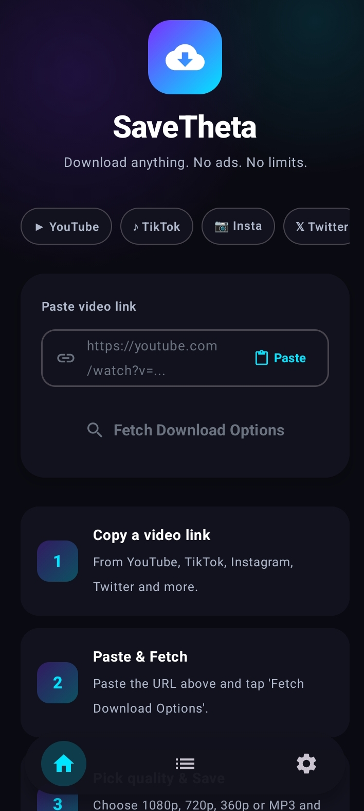
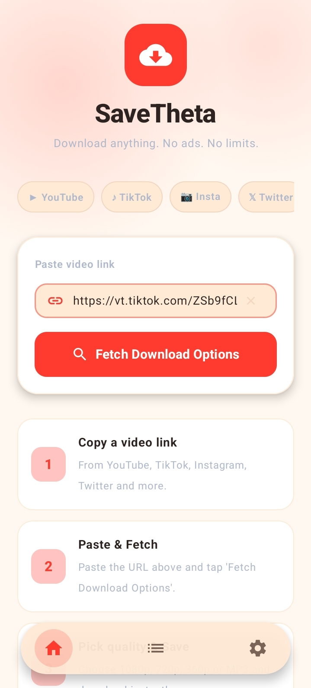
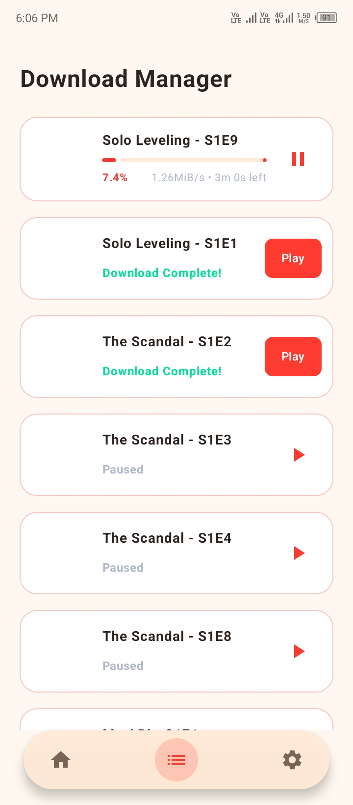
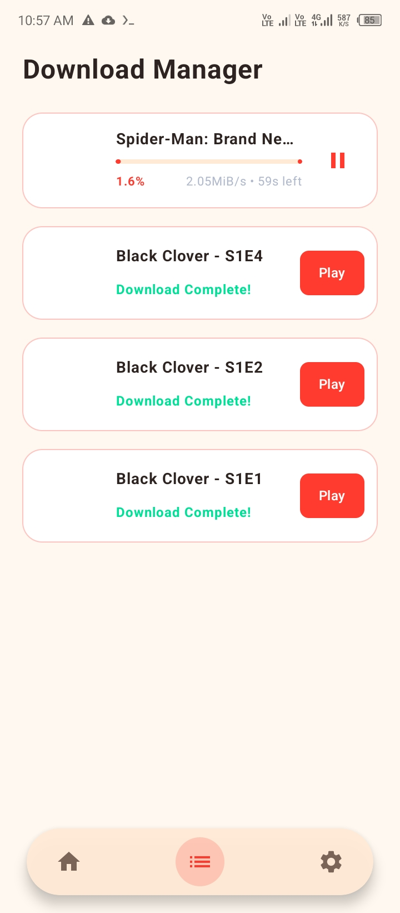
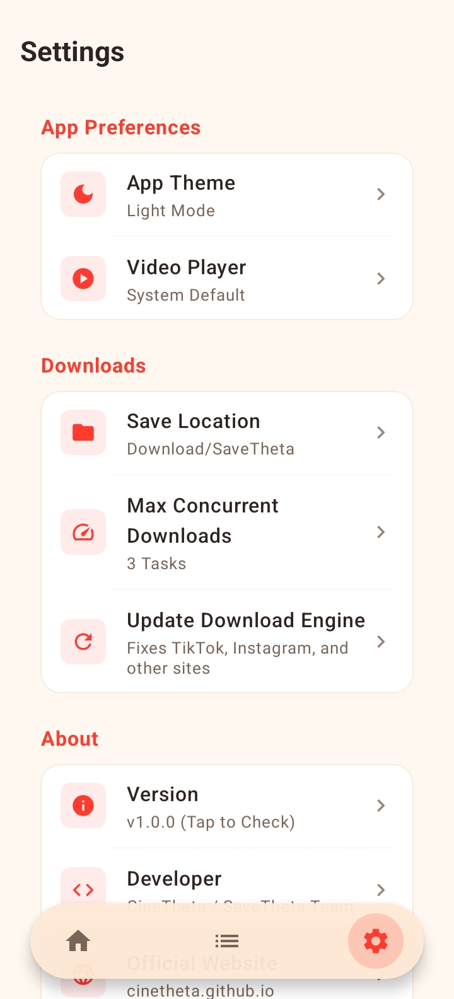

<p align="center">
  
</p>
<h1 align="center">SaveTheta</h1>

<p align="center">
  <strong>The ultimate universal media downloader for Android, powered by yt-dlp & FFmpeg.</strong>
</p>

## ✨ Overview

**SaveTheta** is a next-generation video and audio downloader for Android. Designed as the official companion download engine for **[CineTheta](https://cinetheta.github.io)**, it seamlessly intercepts streams and downloads them locally with unprecedented speed and reliability. 

But it doesn't stop at movies—thanks to its dual `yt-dlp` and `FFmpeg` core, SaveTheta acts as a universal media grabber capable of parsing and downloading from **over 1,000+ websites** on the internet!

## 🚀 Features & Capabilities

- 🔗 **Deep CineTheta Integration:** Catch streams directly from CineTheta. Send HLS/M3U8 links, encrypted streams, or direct MP4s to SaveTheta for flawless background downloading.
- ⚙️ **yt-dlp & FFmpeg Engine:** The most powerful combination for video parsing, audio extraction, and subtitle merging, all running natively on your Android device.
- 🌍 **1000+ Websites Supported:** 
  - 🔴 **YouTube:** Extract *all* available prints and resolutions (4K, 1080p, 720p, 360p, Audio-Only).
  - 🎵 **TikTok:** Download videos in full quality **without watermarks**!
  - 📸 **Instagram:** Grab Reels, IGTV, and video posts.
  - 🐦 **Twitter / X:** Download videos and GIFs directly.
  - 🤖 **Reddit:** Perfectly downloads and merges separate Video + Audio tracks (no more silent Reddit videos!).
  - 📘 **Facebook:** Fetch HD and SD videos from posts and pages.
  - 🎮 **Twitch:** Download Clips and VODs.
  - 📹 **Vimeo**
  - 📌 **Pinterest**
  - 📺 **Dailymotion**
  - *...and literally thousands of other media hosts!*
- 📥 **Advanced Audio & Subtitle Handling:** Automatically detects separate audio tracks and subtitle files, multiplexing them into the final video file seamlessly using FFmpeg.
- 🔄 **OTA Auto-Updates:** SaveTheta checks the official GitHub repository for the latest `yt-dlp` engine patches and app updates, ensuring website extractors never break.
- 🎨 **Jetpack Compose UI:** A gorgeous, responsive, ad-free Material 3 user interface.

## 📸 Screenshots

<p align="center">
  <b>Home Page (Dark)</b><br><br>
  
</p>
<br>

<p align="center">
  <b>Video Loading / Extraction</b><br><br>
  
</p>
<br>

<p align="center">
  <b>Video Downloading</b><br><br>
  
</p>
<br>

<p align="center">
  <b>Download Details</b><br><br>
  
</p>
<br>

<p align="center">
  <b>Settings Page</b><br><br>
  
</p>

## 🛠️ Tech Stack

- **Language:** [Kotlin](https://kotlinlang.org/)
- **UI Toolkit:** [Jetpack Compose](https://developer.android.com/jetpack/compose)
- **Engine Core:** [yt-dlp-android](https://github.com/yausername/youtubedl-android) & [FFmpegKit](https://github.com/arthenica/ffmpeg-kit)
- **Architecture:** MVVM + Kotlin Coroutines

## 🚀 Getting Started

### Prerequisites
- Android Studio (Latest Stable)
- Android SDK API Level 24+

### Build Instructions
1. Clone the repository:
   ```bash
   git clone https://github.com/cinetheta/SaveTheta.git
   ```
2. Open the project in Android Studio.
3. Sync Gradle and build the app! 
   *(Note: SaveTheta's release mode has `isMinifyEnabled = false` by default to ensure perfect stability with complex FFmpeg JNI binaries).*

## 💖 Support the Ecosystem

SaveTheta is part of the CineTheta ecosystem. If you love this open-source suite and want to support ongoing server maintenance and development, consider donating:

| Method | Details | Network / Note |
| :--- | :--- | :--- |
| 🟡 **Binance Pay** | `1041683310` | Instant, 0% fees |
| 🟢 **USDT** | `TJEbUfurBzdNhFARk6STdzNKAKpuQR5g6j` | **Tron (TRC-20)** |

## ⚖️ Disclaimer
**SaveTheta** is a client-side utility tool. It does not host, store, or distribute any media. Users are solely responsible for ensuring they have the legal right to download the media they access through this application. Use this software responsibly and in compliance with local copyright laws.

---
<p align="center">Made with ❤️ for the open-source community.</p>
